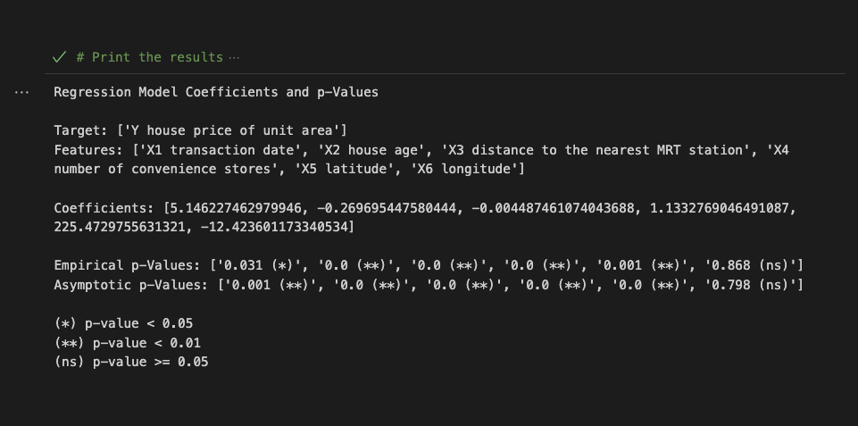

# randomization_tests

> **[Quick Start](docs/QUICKSTART.md)** · **[API Reference](docs/API.md)** · **[Roadmap](docs/ROADMAP.md)**

THE SIGNIFICANCE OF PERMUTATION TESTS FOR PROGRAM ASSESSMENT WITH OBSERVATIONAL DATA: ADDRESSING THE ISSUE OF STATISTICAL INFERENCE WITH NONPROBABILITY SAMPLES

Abstract

Nonprobability samples and self-selected group memberships are frequent aspects of "people data" that analysts must navigate to infer the proper conclusions. The application of randomization tests or permutation tests to experimental data is more familiar to researchers within the behavioral sciences and the medical sciences, primarily as a remedy for their often less-than-ideal random samples. However, its relevance to nonprobability samples from observational data in the social sciences is less recognized. One reason for this unfamiliarity is that inferences under these conditions are limited to conclusions within the sample. Fortunately, this limitation is not a significant constraint for common research questions related to program assessment in nonexperimental settings, where there is no need to generalize findings to a larger hypothetical population. If an analyst wants to evaluate whether participants in a program experienced a significant change in outcomes using a nonprobability sample, their concern is with the outcome for that specific sample and its statistical significance. There is no need to generalize to a broader population to answer a sample-specific research inquiry.

Body Text

In the book *Randomization Tests*, Edgington (1980) opens with a trenchant critique of the twinned myth of experimental design and statistical inference:

> Experimental design books and others on the application of statistical tests to experimental data perpetuate the long-standing fiction of random sampling in experimental research. Statistical inferences are said to require random sampling and to concern population parameters. In experimentation, however, random sampling is very infrequent; consequently, statistical inferences about populations are usually irrelevant. Thus there is no logical connection between the random sampling model and its application to data from the typical experiment. The artificiality of the random sampling assumption has undoubtedly contributed to the skepticism of some experimenters regarding the value of statistical tests. What is a more important consequence of failure to recognize the prevalence of nonrandom sampling in experimentation, however, is overlooking the need for special statistical procedures that are appropriate for nonrandom samples. As a result, the development and application of randomization tests have suffered.

> Randomization tests are statistical tests in which the data are repeatedly divided, a test statistic (e.g., t or F) is computed for each data division, and the proportion of the data divisions with as large a test statistic value an the value for the obtained results determines the significance of the results. For testing hypotheses about experimental treatment effects, random assignment but not random sampling is required. In the absence of random sampling the statistical inferences are restricted to the subjects actually used in the experiment, and generalization to other subjects must be justified by non-statistical argument.

> Random assignment is the only random element necessary for determining the significance of experimental results by the randomization test procedure; therefore assumptions regarding random sampling and those regarding normality, homogeneity of variance, and other characteristics of randomly sampled populations, are unnecessary. Thus, any statistical test, no matter how simple or complex, is transformed into a distribution-free test when significance is determined by the randomization test procedure. For any experiment with random assignment, the experimenter can guarantee the validity of any test [they want] to use by determining significance by the randomization test procedure. Chapter 1 summarizes various advantages of the randomization test procedure, including its potential for developing statistical tests to meet the special requirements of a particular experiment, and its usefulness in providing for the valid use of statistical tests on experimental data from a single subject.

> A great deal of computation is involved in performing a randomization test and, for that reason, such a means of determining significance was impractical until recent years, when computers became accessible to experimenters. As the use of computers is essential for the practical application of randomization tests, computer programs for randomization tests accompany discussions throughout the book. The programs will be useful for a number of practical applications of randomization tests, but their main purpose is to show how programs for randomization tests are written.

> Inasmuch as the determination of significance by the randomization test procedure makes any of the hundreds (perhaps thousands) of published statistical tests into randomization tests, the discussion of application of randomization tests in this book cannot be exhaustive. Applications in the book have been selected to illustrate different facets of randomization tests so that the experimenter will have a good basis for generalizing to other applications. (P. v-vii)

He then continues by sketching the outline of a solution, describing the intuition behind a simple but expensive test that leverages the notions of permutation and random assignment to address the issue of nonprobability (or nonrandom) samples:

> A randomization test is a permutation test based on randomization (random assignment), where the test is carried out in the following manner. A test statistic is computed for the experimental data, then the data are permuted (divided or rearranged) repeatedly in a manner consistent with the random assignment procedure, and the test statistic is computed for each of the resulting data permutations. These data permutations, including the one representing the obtained results, constitute the reference set for determining significance. The proportion of data permutations in the reference set that have test statistic values greater than or equal to (or, for certain test statistics, less than or equal to) the value for the experimentally obtained results is the P-value (significance or probability value). If, for example, the proportion is 0.02, the P-value is 0.02, and the results are significant at the 0.05 but not the 0.01 level of significance. Determining significance on the basis of a distribution of test statistics generated by permuting the data is characteristic of all permutation tests; it is when the basis for permuting the data is random assignment that a permutation test is called a randomization test. (P. 1)

Given the language of 'experimentation' used throughout these passages, it is perhaps unsurprising that the application of randomization tests or permutation tests to experimental data is more familiar to researchers within the behavioral sciences (e.g., Mewhort, Johns, and Kelly [2010](https://link.springer.com/article/10.3758/BRM.42.2.366)) and the medical sciences (e.g., Rigdon and Hudgens [2014](https://onlinelibrary.wiley.com/doi/pdf/10.1002/sim.6384?casa_token=hpwlySMrlmcAAAAA:7DOYCE4Z4XD6leNc2Z5hplMK3JjuLgn7JAkiWzm0EpXd2CLUPxJYn_1RJ7cLv0DG9vcyFK0ztSuXkuCV)) as a corrective for regularly non-ideal sampling conditions. On face value, lesser known is its relevance for observational data within the social sciences (yet see Taylor [2020](https://journals.sagepub.com/doi/pdf/10.1177/1536867X20930999); Taylor [2024](https://www.tandfonline.com/doi/full/10.1080/14742837.2024.2365747)). However, it should be noted that there is an established history of randomization tests and permutation tests within social network analysis as it is employed by the QAP (Hubert and Schultz [1976](https://bpspsychub.onlinelibrary.wiley.com/doi/10.1111/j.2044-8317.1976.tb00714.x)) and MRQAP (Krackhardt [1988](https://doi.org/10.1016/0378-8733(88)90004-4)) techniques. That said, the idea that randomization tests or permutation tests can be applied to observational data and not just experimental data is well founded (see Box and Andersen [1954](https://repository.lib.ncsu.edu/server/api/core/bitstreams/804fd57d-c6a3-48c2-925d-cbbd4b7e0a5b/content); Chung and Fraser [1958](https://www.jstor.org/stable/2282050); Rubin [1974](https://psycnet.apa.org/record/1975-06502-001)).

Part of the reason for its unfamiliarity in the context of observational data are the limitations of nonprobability sample hypothesis tests to within-sample conclusions. Fortunately, given the scope of common research questions on program assessment under nonexperimental settings, which lack the need to generalize to a larger hypothetical population to answer, these limitations do not place any greater constraints on their scope than is needed for an answer. For example, if an analyst desires to assess whether adherents to a program experienced some significantly changed outcome using a nonprobability sample, all that analyst cares about is that outcome for that sample and if it was statistically significant. There is no need to generalize to a larger hypothetical population to complete that assessment. As Taylor ([2024](https://www.tandfonline.com/doi/full/10.1080/14742837.2024.2365747)) succinctly explains regarding the practicalities of hypothesis testing with nonprobability data in his application of randomization inference techniques to a study of 34 white nationalist organizations (WNOs):

> Since the data used here constitute a nonprobability sample, asymptotically derived standard errors and generalizations to a 'population' are not appropriate. I instead rely on p-values derived from Monte Carlo permutation tests to draw sample-specific inferences (Darlington & Hayes, 2016, pp. 513-514; Ernst, 2004; Ludbrook & Dudley, 1998; Manly, 2018). In this case, p-values indicate the proportion of estimates of a particular coefficient after randomly permuting the data that are greater than or equal to the absolute size of the observed ('real') coefficient. If the association between the outcome and some predictor were random, then we should expect any random reshuffling of one of those variables across cases to produce a regression estimate of a similar absolute magnitude. If the observed estimate is consistently larger than the ones produced after a series of random shuffles, then the observed estimate is likely generated from nonrandom mechanism. The outcome was the permuted variable, and permutations were done within organizations to reflect the fact that only within-organization variance is being modeled. (PP. 10-11)

Analyst concerns regarding the dread of 'self-selection' in experimental designs can be assuaged by reframing their understanding of the kind of hypotheses tested in terms of the more limited observational assessments, where data are collected by recording events as they 'naturally' take place without manipulations. As program participants are no longer subject to intervention group and control group assignments, but are instead observed to take part in some behavior, the analyst can only offer evidence that those engaging in that behavior differed significantly from their counterparts through the assumption of exchangeability. That is, the belief that the null hypothesis of there being no significant difference should hold for those in the sample when there actually is no significant difference between them. Here random assignment being induced via permuting. Importantly, the assumption of exchangeable data is weaker than the assumption of independent and identically distributed data. All independent and identically distributed data are exchangeable, but not all exchangeable data are independent and identically distributed.

Future Directions

It is within this context that the present package is situated. It seeks to create a suite of distribution-free inferential tools whose validity rests on the assumption of exchangeability rather than on appeal to unknown population parameters. In its current form, it implements the single-equation case for linear and logistic regression. Three permutation methods are provided: the ter Braak ([1992](https://doi.org/10.1007/978-3-642-48850-4_10)) residual permutation, in which residuals from the reduced model are permuted and added back to the fitted values of the reduced model before the full model is re-estimated on the resulting synthetic response; the Kennedy ([1995](https://doi.org/10.1080/03610919508813272)) individual exposure-residual permutation, which isolates the treatment coefficient by permuting only the residualized exposure after the confounders have been partialled out; and the Kennedy ([1995](https://doi.org/10.1080/03610919508813272)) joint *F*-style test, which evaluates the omnibus null hypothesis that all coefficients are simultaneously zero. These methods address the foundational problem outlined above: valid inference without distributional assumptions when the analyst's concern is limited to the sample at hand.

However, many of the research questions that arise in observational program assessment are not confined to a single outcome equation. Mediation analysis requires at a minimum two structural equations: the mediator regressed on exposure and the outcome regressed on both mediator and exposure, with the indirect effect computed as the product of coefficients across them. Path models, multi-level designs, and moderated mediation introduce additional structural and exchangeability constraints that a single-equation permutation framework cannot express. The extension of permutation methods to these multi-equation settings has a developing literature. Pesarin and Salmaso ([2010](https://doi.org/10.1002/9780470689516)) provide a general theory of nonparametric combination (NPC) for dependent permutation tests, wherein test statistics from multiple equations are combined via a combining function while the joint null distribution is obtained by simultaneous permutation. This addresses the dependence that arises when equations share observations or when upstream permuted variables causally influence downstream outcomes. On a related note, the question of which residual permutation strategy to employ within a given equation remains an active area of investigation. The Freedman–Lane procedure (Freedman and Lane [1983](https://doi.org/10.1080/07350015.1983.10509354)), which permutes residuals from the full model added to fitted values of the reduced model, has been shown to offer superior power relative to the Kennedy approach when predictors are correlated (Anderson and Legendre [1999](https://doi.org/10.1080/00949659908811936); Winkler et al. [2014](https://doi.org/10.1016/j.neuroimage.2014.01.060)) and serves as the default permutation method in neuroimaging software such as FSL PALM.

The question of *which* observations may be permuted with *which* is formalized by the notion of exchangeability. As established above, exchangeability is a strictly weaker condition than the assumption of independent and identically distributed data: it requires only that the joint distribution of observations be invariant under finite permutations, without requiring that observations share a common marginal distribution or be mutually independent. De Finetti's ([1937](http://www.numdam.org/item/AIHP_1937__7_1_1_0/)) representation theorem demonstrates that any infinite exchangeable sequence admits a representation as a mixture of independent and identically distributed sequences conditioned on a latent mixing measure. This provides the probabilistic foundation on which permutation tests rest. In clustered or multilevel settings, however, exchangeability does not hold globally across all observations but instead obtains only within defined strata: students within classrooms may be exchangeable, while classrooms within schools constitute a separate exchangeability stratum. Winkler et al. ([2015](https://doi.org/10.1016/j.neuroimage.2015.05.092)) formalize this as multi-level exchangeability blocks and demonstrate that ignoring the nesting structure inflates false-positive rates, invalidating the guarantees that the permutation approach is designed to provide. The exchangeability structure must be specified as an explicit component of the model, not imposed post hoc.

These considerations point toward a natural generalization: a graph-structured permutation framework in which each variable's structural equation, model family, and exchangeability constraints are declared as part of a typed specification and tested under a unified inference engine. The directed hypergraph, in which a single edge may connect an arbitrary subset of nodes rather than only a pair, is well suited to expressing irreducible group-level causal claims such as interaction effects that cannot be decomposed into pairwise relationships. This line of development draws on Pearl's ([2009](https://doi.org/10.1017/CBO9780511803161)) structural causal model framework, wherein each variable is generated by a deterministic function of its parents and an exogenous disturbance, and on Rosenbaum's ([2002](https://doi.org/10.1007/978-1-4757-3692-2)) development of sensitivity analysis for permutation-based causal inference in observational settings. The intersection of these programs defines the experimental direction of this package: distribution-free inference layered over graph-structured causal specifications with hierarchical exchangeability constraints. Further details on the planned implementation are given in the [roadmap](docs/ROADMAP.md).

References:

Anderson, M. J. and P. Legendre. 1999. "An empirical comparison of permutation methods for tests of partial regression coefficients in a linear model." *Journal of Statistical Computation and Simulation*, 62(3):271-303.

Berry, K. J., Johnston, J. E., and P. W. Mielke. 2011. "Permutation methods." *Wiley Interdisciplinary Reviews: Computational Statistics*, 3(6):527-542.

Box, G. E. and S. L. Andersen. 1954. "Robust tests for variances and effect of non-normality and variance heterogeneity on standard tests." *Technical Report, North Carolina State University Institute of Statistics Mimeo Series.*

Chung, J. H. and D. A. S. Fraser. 1958. "Randomization tests for a multivariate two-sample problem." *Journal of the American Statistical Association*, 53(283):729-735.

De Finetti, B. 1937. "La prévision: ses lois logiques, ses sources subjectives." *Annales de l'Institut Henri Poincaré*, 7(1):1-68.

Edgington, E. S. 1980. *Randomization tests.* 2nd Ed. New York, NY: Marcel Dekker, Inc.

Freedman, D. and D. Lane. 1983. "A nonstochastic interpretation of reported significance levels." *Journal of Business & Economic Statistics*, 1(4):292-298.

Hubert, L. J. and J. Schultz. 1976. "Quadratic assignment as a general data analysis strategy." *British Journal of Mathematical and Statistical Psychology*, 29:190-241.

Kennedy, P. E. 1995. "Randomization tests for multiple regression." *Communications in Statistics — Simulation and Computation*, 24(4):923-936.

Krackhardt, D. 1988. "Predicting with networks: nonparametric multiple regression analysis of dyadic data." *Social Networks*, 10:359-381.

Mewhort, D. J. K., Johns, B. T., and M. A. Kelly. 2010. "Applying the permutation test to factorial designs." *Behavior Research Methods*, 42:366-372.

Pearl, J. 2009. *Causality: models, reasoning, and inference.* 2nd Ed. Cambridge, UK: Cambridge University Press.

Pesarin, F. and L. Salmaso. 2010. *Permutation tests for complex data: theory, applications and software.* Chichester, UK: John Wiley & Sons.

Rigdon, J. and M. G. Hudgens. 2015. "Randomization inference for treatment effects on a binary outcome." *Statistics in Medicine*, 34(6):924-935.

Rosenbaum, P. R. 2002. *Observational studies.* 2nd Ed. New York, NY: Springer.

Rubin, D. B. 1974. "Estimating causal effects of treatments in randomized and nonrandomized studies." *Journal of educational Psychology*, 66:688-701.

Taylor, M. A. 2020. "Visualization strategies for regression estimates with randomization inference." *The Stata Journal*, 20(2):309-335.

Taylor, M. A. 2024. "Attention, shocks, and relevance judgements: the case of white nationalism in the U.S. South, 1980-2008." *Social Movement Studies*, 1-18.

ter Braak, C. J. F. 1992. "Permutation versus bootstrap significance tests in multiple regression and ANOVA." In K.-H. Jöckel, G. Rothe, and W. Sendler (eds.), *Bootstrapping and Related Techniques*, 79-85. Berlin: Springer.

Winkler, A. M., Ridgway, G. R., Webster, M. A., Smith, S. M., and T. E. Nichols. 2014. "Permutation inference for the general linear model." *NeuroImage*, 92:381-397.

Winkler, A. M., Webster, M. A., Vidaurre, D., Nichols, T. E., and S. M. Smith. 2015. "Multi-level block permutation." *NeuroImage*, 123:253-268.

Dataset Citations:

Wolberg, W. "Breast Cancer Wisconsin (Diagnostic)," UCI Machine Learning Repository, 1995. [Online]. Available: https://doi.org/10.24432/C5DW2B.

Yeh, I. "Real Estate Valuation," UCI Machine Learning Repository, 2018. [Online]. Available: https://doi.org/10.24432/C5J30W.
