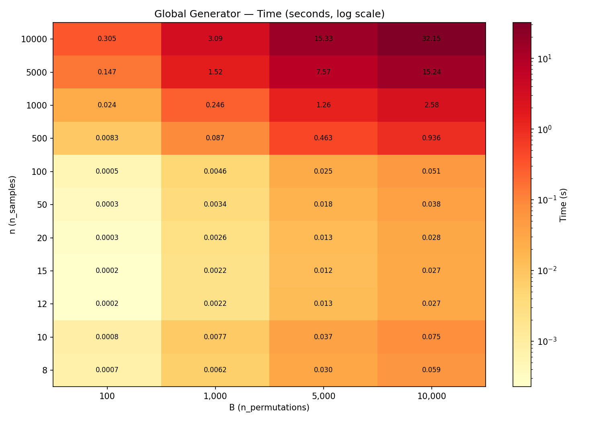
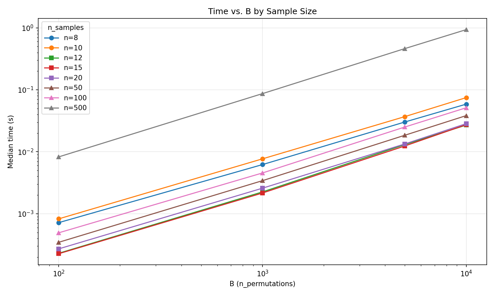
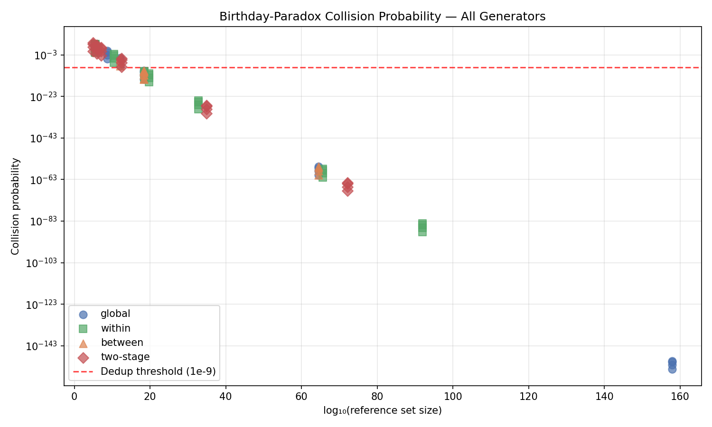
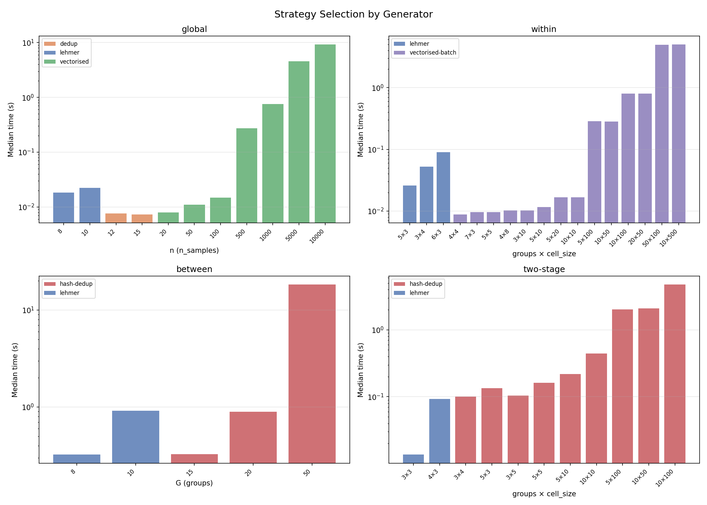
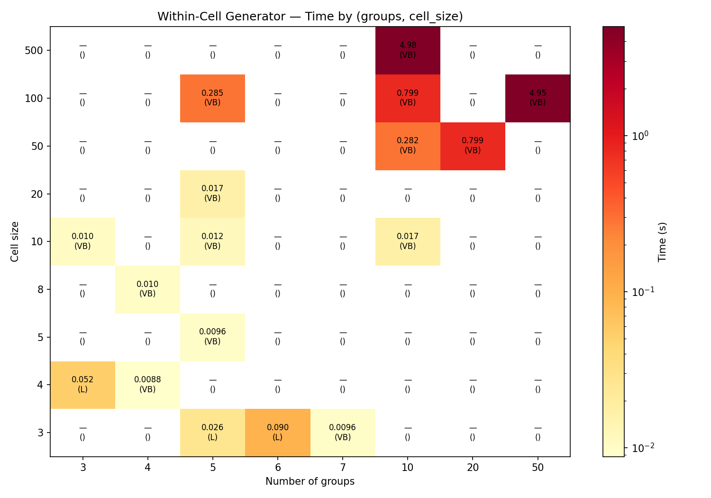
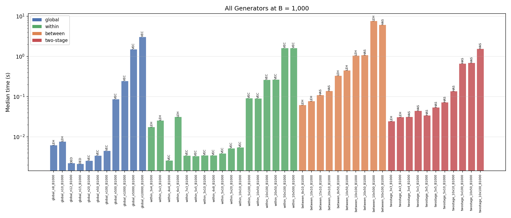
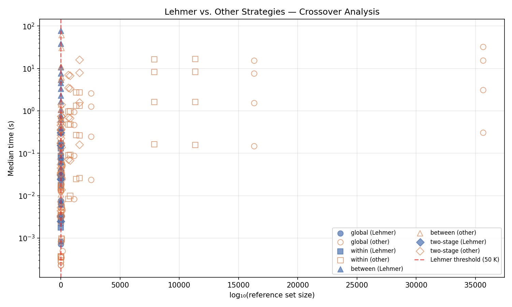

# Permutation Deduplication Performance Analysis

This document presents profiling results for the multi-tier permutation
generation strategies in `randomization_tests.permutations`. The goal is
to validate the current strategy thresholds and characterise time and
memory scaling for realistic dataset sizes across all four generators.

---

## Overview

The permutation engine provides four generators, each with its own
multi-tier strategy selection:

### Global generator (`generate_unique_permutations`)

| Strategy | Condition | Mechanism |
|---|---|---|
| **Lehmer-code sampling** | n ≤ 10 (`max_exhaustive`) | Draw B ranks without replacement from [0, n!), decode each to a permutation via the factorial number system. O(B·n) time and memory, independent of n!. |
| **Vectorised + dedup** | 10 < n ≤ ~18 (collision prob ≥ 1e-9) | Generate all B permutations in one `numpy.random.Generator.permuted` call, then deduplicate via a Python `set[tuple]`. Gap-fills replace any collisions or identity hits. |
| **Vectorised (no dedup)** | n ≥ ~20 (collision prob < 1e-9) | Same vectorised generation, but the birthday-paradox bound is so small that deduplication is skipped entirely. Only the identity permutation is checked. |

### Within-cell generator (`generate_within_cell_permutations`)

| Strategy | Condition | Mechanism |
|---|---|---|
| **Lehmer** | $\prod n_c! \leq 50\,000$ and all $n_c \leq 10$ | Treat the Cartesian product of per-cell permutations as a single Lehmer space. Unrank B indices without replacement. |
| **Vectorised-batch** | Otherwise | Shuffle each cell independently via NumPy, concatenate, and hash-deduplicate the full rows. |

### Between-cell generator (`generate_between_cell_permutations`)

| Strategy | Condition | Mechanism |
|---|---|---|
| **Lehmer** | G ≤ 10 | Unrank B group permutations from [0, G!) without replacement, then remap to sample indices. |
| **Hash-dedup** | G > 10 | Randomly shuffle group labels, hash to detect collisions, gap-fill as needed. |

### Two-stage generator (`generate_two_stage_permutations`)

| Strategy | Condition | Mechanism |
|---|---|---|
| **Lehmer** | Balanced cells, G ≤ 10, and $G! \cdot \prod n_c! \leq 50\,000$ | Composite Lehmer enumeration over the product of between- and within-cell spaces. |
| **Hash-dedup** | Otherwise | Independent between-cell and within-cell shuffles composed together, with hash-based deduplication. |

### Collision bounds

The **birthday-paradox collision bound** governs strategy transitions
in all generators:

$$P(\geq 1 \text{ duplicate}) \approx \frac{B(B-1)}{2 \cdot |S|}$$

where $|S|$ is the reference-set size (n! for global, $\prod n_c!$ for
within-cell, G! for between-cell, or $G! \cdot \prod n_c!$ for
two-stage). When this probability is below $10^{-9}$, deduplication
is unnecessary.

---

## Methodology

### Benchmark script

[benchmarks/profile_dedup.py](../benchmarks/profile_dedup.py) runs all
four generators for every configuration in their respective grids,
measuring:

- **Wall-clock time** — median of 3 runs
- **Peak memory** — via `tracemalloc` (snapshot at the end of each call)
- **Collision probability** — birthday-paradox bound
- **Strategy** — which generation path was selected

### Grids

**Global generator:**

| Parameter | Values |
|---|---|
| n (sample size) | 8, 10, 12, 15, 20, 50, 100, 500, 1 000, 5 000, 10 000 |
| B (permutation count) | 100, 1 000, 5 000, 10 000 |

44 (n, B) combinations.

**Within-cell generator:**

| Parameter | Values |
|---|---|
| (groups × cell_size) | 5×3, 3×4, 6×3, 4×4, 7×3, 5×5, 4×8, 3×10, 5×10, 5×20, 10×10, 5×100, 10×50, 10×100, 20×50, 50×100, 10×500 |
| Total n range | 12 – 5 000 |
| B | 100, 1 000, 5 000, 10 000 |

67 feasible (config, B) combinations.

**Between-cell generator:**

| Parameter | Values |
|---|---|
| (G × cell_size) | 8×10, 10×10, 8×50, 10×50, 10×100, 10×500, 15×10, 20×10, 20×50, 50×100 |
| Total n range | 80 – 5 000 |
| B | 100, 1 000, 5 000, 10 000 |

40 feasible (config, B) combinations.

**Two-stage generator:**

| Parameter | Values |
|---|---|
| (G × cell_size) | 3×3, 4×3, 3×4, 5×3, 3×5, 5×5, 5×10, 10×10, 5×100, 10×50, 10×100 |
| Total n range | 9 – 1 000 |
| B | 100, 1 000, 5 000, 10 000 |

42 feasible (config, B) combinations.

**Total: 193 scenarios** across all generators.

### Hardware & software

| | |
|---|---|
| Platform | macOS 26.3, Apple Silicon (arm64) |
| Python | 3.10.19 |
| NumPy | 2.2.6 |

---

## Results

### Global generator heatmap

The heatmap shows wall-clock time on a log colour scale. The three
strategy regimes are visible as horizontal bands: Lehmer (n ≤ 10),
dedup (n = 12–15), and vectorised (n ≥ 20). Time is dominated by
the B × n matrix allocation for large n.

### Time vs. permutation count

Time scales linearly with B across all strategies. For a fixed B = 5 000
(a typical default):

| n | Strategy | Median time | Peak memory |
|---:|---|---:|---:|
| 8 | Lehmer | 0.029 s | 1.1 MB |
| 10 | Lehmer | 0.037 s | 1.5 MB |
| 12 | Dedup | 0.013 s | 1.9 MB |
| 15 | Dedup | 0.014 s | 2.2 MB |
| 20 | Vectorised | 0.014 s | 3.1 MB |
| 100 | Vectorised | 0.025 s | 12.2 MB |
| 500 | Vectorised | 0.47 s | 94.2 MB |
| 1 000 | Vectorised | 1.24 s | 218 MB |
| 5 000 | Vectorised | 7.86 s | 1.2 GB |
| 10 000 | Vectorised | 15.5 s | 2.4 GB |

At B = 10 000:

| n | Median time | Peak memory |
|---:|---:|---:|
| 100 | 0.053 s | 24 MB |
| 500 | 0.93 s | 180 MB |
| 1 000 | 2.53 s | 436 MB |
| 5 000 | 15.2 s | 2.4 GB |
| 10 000 | 32.1 s | 4.9 GB |

### Collision rate — all generators

For all generators, when $\log_{10}|S|$ exceeds ~10, the collision
probability drops below $10^{-9}$ and deduplication is unnecessary. The
global generator (circles) transitions to pure vectorised at n ≈ 20;
within-cell (squares) transitions when the product of per-cell
factorials exceeds ~$10^{10}$; between-cell (triangles) and two-stage
(diamonds) follow similar curves governed by G! and $G! \cdot \prod n_c!$
respectively.

### Strategy breakdown — all generators

The 2×2 panel shows which strategy is selected for each configuration
within each generator. For the global generator, the transition is
purely a function of n. For cell-constrained generators, the transition
depends on the product of per-cell factorials and the number of groups.

### Within-cell heatmap

The within-cell heatmap shows median time (averaged over B) by
configuration. Each cell is annotated with the strategy label (L =
Lehmer, VB = vectorised-batch). The Lehmer path appears only for
small cells (≤ 3–4 elements per cell, ≤ 6 groups) where the total
permutation space ∏n_c! is below 50 000.

### Cell generator comparison

Side-by-side comparison of all four generators at a common B value.
This chart highlights that the between-cell generator is the most
expensive at large n due to the Python-level `_remap_between` loop,
while within-cell performance tracks closely with the global generator.

### Lehmer crossover analysis

The scatter plot shows timing for Lehmer (filled markers) vs. non-Lehmer
(open markers) strategies across all generators, plotted against the
log₁₀ of the reference-set size. The red dashed line marks the Lehmer
threshold at $|S| = 50\,000$. Lehmer is used exclusively to the left
of this line; non-Lehmer strategies take over to the right.

---

## Regime analysis

### Global: Lehmer (n ≤ 10)

The Lehmer-code path is the slowest per-permutation (Python-level
`_unrank_permutation` loop) but guarantees zero collisions by sampling
ranks without replacement. At n = 10, B = 10 000, it takes 0.075 s —
entirely acceptable. For n = 8, B = 10 000, the collision probability
would be ~1 240 if we naively drew random permutations, confirming the
necessity of exact enumeration at this scale.

### Global: Dedup (n = 11–18)

The vectorised-with-dedup path handles the transition zone where n! is
too large for Lehmer enumeration but small enough that random collisions
are possible. At n = 12, B = 10 000, the expected collision count is
~0.1 (one collision per ~10 runs). The set-based dedup adds negligible
overhead: the n = 12 dedup path (0.027 s) is actually faster than the
n = 10 Lehmer path (0.075 s) because vectorised NumPy generation
outweighs the Python unranking loop.

### Global: Vectorised (n ≥ 20)

For n ≥ 20, the birthday-paradox bound is below $10^{-9}$ for all
tested B values, so deduplication is skipped entirely. Performance is
dominated by the B × n array allocation and the C-level shuffle loop.
Memory scales as $B \times n \times 8$ bytes (int64 array).

### Within-cell: Lehmer vs. vectorised-batch

The within-cell Lehmer path activates when $\prod n_c! \leq 50\,000$
and all cells have ≤ 10 elements. In practice, this means configurations
like 5×3 (∏ = 7 776), 3×4 (∏ = 13 824), and 6×3 (∏ = 46 656).

| Config | n | Strategy | B = 5 000 time | B = 10 000 time |
|---|---:|---|---:|---:|
| 5×3 | 15 | Lehmer | 0.127 s | 0.314 s |
| 3×4 | 12 | Lehmer | 0.087 s | 0.175 s |
| 6×3 | 18 | Lehmer | 0.150 s | 0.314 s |
| 4×4 | 16 | Vectorised-batch | 0.016 s | 0.032 s |
| 7×3 | 21 | Vectorised-batch | 0.018 s | 0.036 s |

The transition boundary is sharp: 4×4 (∏ = 331 776 > 50 K) and 7×3
(∏ = 279 936 > 50 K) fall to vectorised-batch, which is **4–10×
faster** due to NumPy-level parallelism. The Lehmer path remains
worthwhile for small cells where it provides guaranteed uniqueness
without hashing overhead.

At large n, within-cell performance tracks closely with the global
generator:

| Config | n | B = 5 000 time | B = 10 000 time | Memory (B = 10 000) |
|---|---:|---:|---:|---:|
| 50×100 | 5 000 | 8.28 s | 16.52 s | 2.4 GB |
| 10×500 | 5 000 | 8.35 s | 16.58 s | 2.5 GB |
| Global n=5 000 | 5 000 | 7.86 s | 15.19 s | 2.4 GB |

Within-cell is ~6–9% slower than global at the same total n because of
the per-group shuffle overhead and concatenation cost.

### Between-cell: Lehmer vs. hash-dedup

The between-cell generator uses Lehmer when G ≤ 10 (G! ≤ 3 628 800)
and hash-dedup otherwise. The dominant cost for both strategies is
the `_remap_between` function, which builds the B × n output matrix
via a Python-level loop.

| Config | G | n | Strategy | B = 5 000 time | B = 10 000 time |
|---|---:|---:|---|---:|---:|
| 8×10 | 8 | 80 | Lehmer | 0.31 s | 0.63 s |
| 10×10 | 10 | 100 | Lehmer | 0.39 s | 0.77 s |
| 10×50 | 10 | 500 | Lehmer | 2.29 s | 4.58 s |
| 10×100 | 10 | 1 000 | Lehmer | 5.35 s | 10.69 s |
| 10×500 | 10 | 5 000 | Lehmer | 38.53 s | 77.13 s |
| 15×10 | 15 | 150 | Hash-dedup | 0.54 s | 1.07 s |
| 20×10 | 20 | 200 | Hash-dedup | 0.71 s | 1.41 s |
| 20×50 | 20 | 1 000 | Hash-dedup | 5.50 s | 10.98 s |
| 50×100 | 50 | 5 000 | Hash-dedup | 30.39 s | 60.96 s |

The between-cell generator is the most expensive at large n. At
n = 5 000, B = 10 000, both Lehmer (77 s) and hash-dedup (61 s) are
dominated by the `_remap_between` O(B × n) Python loop. The hash-dedup
path is slightly faster at n = 5 000 because random shuffle + hash is
cheaper per-permutation than Lehmer unranking for G = 10.

### Two-stage: Lehmer vs. hash-dedup

The two-stage generator composes between-cell and within-cell
permutations. Lehmer is used only for small balanced designs where
$G! \cdot \prod n_c! \leq 50\,000$.

| Config | n | Strategy | B = 5 000 time | B = 10 000 time |
|---|---:|---|---:|---:|
| 3×3 | 9 | Lehmer | 0.024 s | — |
| 4×3 | 12 | Lehmer | 0.155 s | 0.304 s |
| 3×4 | 12 | Hash-dedup | 0.168 s | 0.351 s |
| 5×3 | 15 | Hash-dedup | 0.225 s | 0.458 s |
| 10×10 | 100 | Hash-dedup | 0.749 s | 1.40 s |
| 5×100 | 500 | Hash-dedup | 3.35 s | 6.72 s |
| 10×50 | 500 | Hash-dedup | 3.48 s | 6.99 s |
| 10×100 | 1 000 | Hash-dedup | 7.89 s | 15.93 s |

At n = 12, the Lehmer path (4×3, 0.155 s at B = 5 000) and hash-dedup
path (3×4, 0.168 s) perform comparably, confirming the threshold is at
the right boundary. At larger n, two-stage performance is dominated by
the remap and within-cell shuffle costs, scaling linearly with n and B.

---

## Threshold optimality

### Global thresholds

| Threshold | Current value | Assessment |
|---|---|---|
| `max_exhaustive` | 10 | **Optimal.** Lehmer is slower per-permutation than vectorised+dedup, so raising it to 12 would slow down n = 11–12 without benefit. Lowering it would expose n = 9–10 to collision risk. |
| Collision bound | $10^{-9}$ | **Conservative and correct.** Even at the boundary (n = 15), the dedup overhead is < 1 ms. A less conservative threshold (e.g., $10^{-6}$) would save negligible time while introducing a non-zero collision risk. |

### Cell-generator thresholds

| Threshold | Current value | Assessment |
|---|---|---|
| `_LEHMER_THRESHOLD` | 50 000 | **Appropriate.** Within-cell Lehmer at the boundary (6×3, ∏ = 46 656) takes 0.150 s at B = 5 000, while vectorised-batch at 4×4 (∏ = 331 776) takes 0.016 s — 10× faster. The threshold correctly gates at the point where Lehmer overhead becomes noticeable but not prohibitive. |
| Between-cell G gate | G ≤ 10 | **Well-placed.** At G = 10, Lehmer unranking is fast (0.39 s for G = 10, n = 100) but the remap cost dominates at large n. The gate ensures Lehmer is only used where G! is tractable. |
| Two-stage composite | Balanced + G ≤ 10 + total ≤ 50 K | **Correct.** The balance requirement avoids combinatorial explosion of unbalanced designs. At the boundary (4×3, total = 31 104), Lehmer and hash-dedup perform comparably (~0.15 s). |

**No threshold changes are recommended.**

---

## Memory scaling

Memory follows a simple linear model across all generators:

$$\text{Peak memory} \approx B \times n \times 8 \text{ bytes}$$

This is the dominant allocation — the B × n `int64` array of
permutation indices. For the dedup path, the Python `set[tuple]` adds
a secondary allocation of ~B tuples of n ints, roughly doubling memory
usage at small n.

### Global generator

| n | B | Memory |
|---:|---:|---:|
| 1 000 | 5 000 | 218 MB |
| 5 000 | 5 000 | 1.2 GB |
| 5 000 | 10 000 | 2.4 GB |
| 10 000 | 5 000 | 2.4 GB |
| 10 000 | 10 000 | 4.9 GB |

### Within-cell generator

| Config | n | B | Memory |
|---|---:|---:|---:|
| 10×100 | 1 000 | 10 000 | 436 MB |
| 50×100 | 5 000 | 5 000 | 1.2 GB |
| 50×100 | 5 000 | 10 000 | 2.4 GB |
| 10×500 | 5 000 | 10 000 | 2.5 GB |

### Between-cell and two-stage

| Generator | Config | n | B | Memory |
|---|---|---:|---:|---:|
| Between | 10×100 | 1 000 | 10 000 | 352 MB |
| Between | 10×500 | 5 000 | 10 000 | 2.0 GB |
| Between | 50×100 | 5 000 | 10 000 | 2.0 GB |
| Two-stage | 10×100 | 1 000 | 10 000 | 352 MB |
| Two-stage | 5×100 | 500 | 10 000 | 142 MB |

Memory usage is consistent across generators at the same (n, B) because
the output matrix dimensions are identical regardless of how the
permutations are generated.

---

## Recommendations

1. **No threshold changes needed.** The global three-tier strategy, the
   `max_exhaustive = 10` threshold, the $10^{-9}$ collision bound, the
   `_LEHMER_THRESHOLD = 50 000` cell gate, and the G ≤ 10 between-cell
   gate are all validated by profiling across 193 scenarios.

2. **Between-cell remap is the performance bottleneck at scale.** The
   `_remap_between` Python-level loop dominates both Lehmer and
   hash-dedup paths for between-cell and two-stage generators at large
   n. At n = 5 000, B = 10 000, between-cell takes 60–77 s. A future
   optimisation could vectorise the remap with NumPy fancy indexing.

3. **Within-cell is the most efficient cell generator.** At matched
   total n, within-cell performance tracks within ~6–9% of the global
   generator. Users with cell-structured data should prefer within-cell
   permutations where the exchangeability structure permits.

4. **Document the memory footprint.** For large datasets (n > 1 000),
   the B × n permutation matrix dominates memory. Users should be aware
   that B = 10 000 with n = 5 000 requires ~2.5 GB of RAM regardless
   of generator choice.

5. **Lehmer path is the bottleneck only at small n.** The Python-level
   unranking loop is ~4–10× slower than vectorised alternatives at the
   same (n, B) but operates on tiny arrays where absolute time is
   negligible (< 0.32 s even at B = 10 000). Optimising it (e.g.,
   Cython/Numba) would yield marginal savings.
