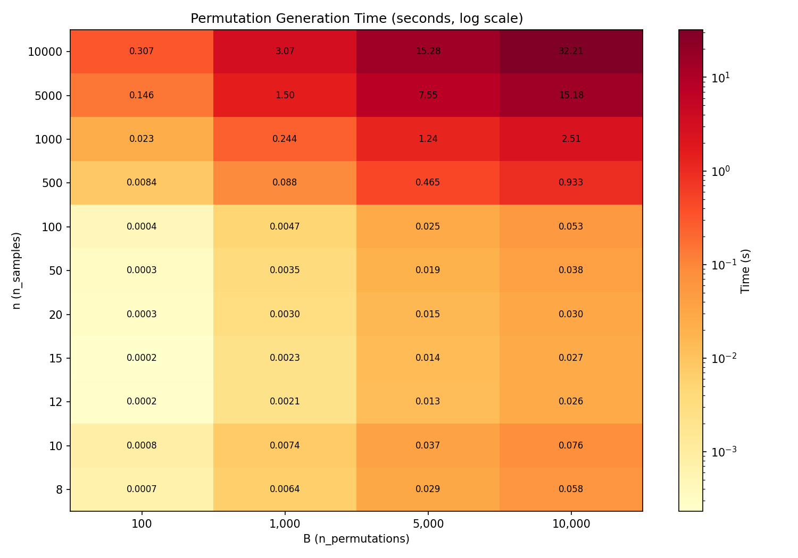
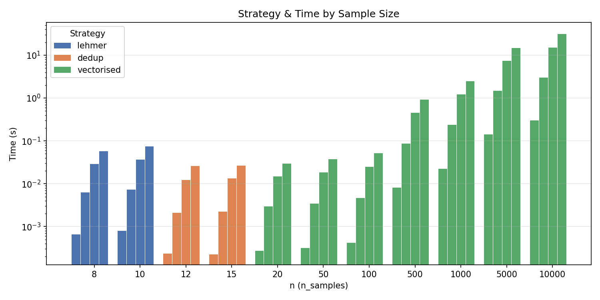

# Permutation Deduplication Performance Analysis

This document presents profiling results for the three-tier permutation
generation strategy in `randomization_tests.permutations`. The goal is
to validate the current strategy thresholds and characterise time and
memory scaling for realistic dataset sizes.

---

## Overview

`generate_unique_permutations` uses three strategies depending on the
sample size *n*:

| Strategy | Condition | Mechanism |
|---|---|---|
| **Lehmer-code sampling** | n ≤ 10 (`max_exhaustive`) | Draw B ranks without replacement from [0, n!), decode each to a permutation via the factorial number system. O(B·n) time and memory, independent of n!. |
| **Vectorised + dedup** | 10 < n ≤ ~18 (collision prob ≥ 1e-9) | Generate all B permutations in one `numpy.random.Generator.permuted` call, then deduplicate via a Python `set[tuple]`. Gap-fills replace any collisions or identity hits. |
| **Vectorised (no dedup)** | n ≥ ~20 (collision prob < 1e-9) | Same vectorised generation, but the birthday-paradox bound B(B−1)/(2·n!) is so small that deduplication is skipped entirely. Only the identity permutation is checked. |

The **birthday-paradox collision bound** governs the Lehmer → dedup →
vectorised transitions:

$$P(\geq 1 \text{ duplicate}) \approx \frac{B(B-1)}{2 \cdot n!}$$

When this probability is below $10^{-9}$, deduplication is unnecessary.

---

## Methodology

### Benchmark script

[benchmarks/profile_dedup.py](../benchmarks/profile_dedup.py) runs
`generate_unique_permutations` for every (n, B) combination in a grid,
measuring:

- **Wall-clock time** — median of 3 runs
- **Peak memory** — via `tracemalloc` (snapshot at the end of each call)
- **Collision probability** — birthday-paradox bound
- **Strategy** — which generation path was selected

### Grid

| Parameter | Values |
|---|---|
| n (sample size) | 8, 10, 12, 15, 20, 50, 100, 500, 1 000, 5 000, 10 000 |
| B (permutation count) | 100, 1 000, 5 000, 10 000 |
| Repeats | 3 (median reported) |

Total: 44 (n, B) combinations.

### Hardware & software

| | |
|---|---|
| Platform | macOS 26.3, Apple Silicon (arm64) |
| Python | 3.10.19 |
| NumPy | 2.2.6 |

---

## Results

### Timing heatmap

The heatmap shows wall-clock time on a log colour scale. The three
strategy regimes are visible as horizontal bands: Lehmer (n ≤ 10),
dedup (n = 12–15), and vectorised (n ≥ 20). Time is dominated by
the B × n matrix allocation for large n.

### Time vs. permutation count

Time scales linearly with B across all strategies. For a fixed B = 5 000
(a typical default):

| n | Strategy | Median time | Peak memory |
|---:|---|---:|---:|
| 8 | Lehmer | 0.029 s | 1.1 MB |
| 10 | Lehmer | 0.037 s | 1.5 MB |
| 12 | Dedup | 0.013 s | 1.9 MB |
| 15 | Dedup | 0.014 s | 2.2 MB |
| 20 | Vectorised | 0.015 s | 3.1 MB |
| 100 | Vectorised | 0.025 s | 12.2 MB |
| 500 | Vectorised | 0.465 s | 90.4 MB |
| 1 000 | Vectorised | 1.24 s | 214 MB |
| 5 000 | Vectorised | 7.55 s | 1.2 GB |
| 10 000 | Vectorised | 15.3 s | 2.4 GB |

At B = 10 000:

| n | Median time | Peak memory |
|---:|---:|---:|
| 100 | 0.053 s | 23.8 MB |
| 500 | 0.93 s | 180 MB |
| 1 000 | 2.51 s | 428 MB |
| 5 000 | 15.2 s | 2.4 GB |
| 10 000 | 32.2 s | 4.9 GB |

### Collision rate

For n ≥ 20, the collision probability is astronomically small
($< 10^{-11}$); deduplication would be pure overhead. For n = 12 at
B = 10 000, the collision probability is ~0.1 — non-negligible but
manageable via the set-based dedup pass. The Lehmer path (n ≤ 10)
sidesteps collisions entirely by sampling ranks without replacement.

### Strategy breakdown

---

## Regime analysis

### Lehmer (n ≤ 10)

The Lehmer-code path is the slowest per-permutation (Python-level
`_unrank_permutation` loop) but guarantees zero collisions by sampling
ranks without replacement. At n = 10, B = 10 000, it takes 0.076 s —
entirely acceptable. For n = 8, B = 10 000, the collision probability
would be ~1 240 if we naively drew random permutations, confirming the
necessity of exact enumeration at this scale.

### Dedup (n = 11–18)

The vectorised-with-dedup path handles the transition zone where n! is
too large for Lehmer enumeration but small enough that random collisions
are possible. At n = 12, B = 10 000, the expected collision count is
~0.1 (one collision per ~10 runs). The set-based dedup adds negligible
overhead: the n = 12 dedup path (0.027 s) is actually faster than the
n = 10 Lehmer path (0.076 s) because vectorised NumPy generation
outweighs the Python unranking loop.

### Vectorised, no dedup (n ≥ 20)

For n ≥ 20, the birthday-paradox bound is below $10^{-9}$ for all
tested B values, so deduplication is skipped entirely. Performance is
dominated by the B × n array allocation and the C-level shuffle loop.
Memory scales as $B \times n \times 8$ bytes (int64 array).

The n = 20 boundary is conservative: at n = 15, the collision
probability for B = 10 000 is only $3.8 \times 10^{-5}$, meaning the
dedup pass runs but almost never finds a collision. However, the dedup
overhead at this scale is negligible (< 1 ms), so the conservative
boundary adds safety without measurable cost.

### Threshold optimality

The current thresholds appear well-chosen:

| Threshold | Current value | Assessment |
|---|---|---|
| `max_exhaustive` | 10 | **Optimal.** Lehmer is slower per-permutation than vectorised+dedup, so raising it to 12 would slow down n = 11–12 without benefit. Lowering it would expose n = 9–10 to collision risk. |
| Collision bound | $10^{-9}$ | **Conservative and correct.** Even at the boundary (n = 15), the dedup overhead is < 1 ms. A less conservative threshold (e.g., $10^{-6}$) would save negligible time while introducing a non-zero collision risk. |

**No threshold changes are recommended.**

---

## Memory scaling

Memory follows a simple linear model:

$$\text{Peak memory} \approx B \times n \times 8 \text{ bytes}$$

This is the dominant allocation — the B × n `int64` array of
permutation indices. For the dedup path, the Python `set[tuple]` adds
a secondary allocation of ~B tuples of n ints, roughly doubling memory
usage at small n (visible in the n = 12 row: 3.4 MB vs. the predicted
1.0 MB from the array alone).

At large n, memory becomes the primary constraint:

| n | B | Memory |
|---:|---:|---:|
| 5 000 | 5 000 | 1.2 GB |
| 5 000 | 10 000 | 2.4 GB |
| 10 000 | 5 000 | 2.4 GB |
| 10 000 | 10 000 | 4.9 GB |

For datasets with n > 5 000 and the default B = 5 000, memory usage is
manageable on modern hardware. Users requesting B = 10 000 with
n = 10 000 should expect ~5 GB of transient allocation.

---

## Recommendations

1. **No code changes needed.** The current three-tier strategy, the
   `max_exhaustive = 10` threshold, and the $10^{-9}$ collision bound
   are all validated by profiling. No actionable bottlenecks were found.

2. **Document the memory footprint.** For large datasets (n > 1 000),
   the B × n permutation matrix dominates memory. Users should be aware
   that B = 10 000 with n = 10 000 requires ~5 GB of RAM. A future
   enhancement (v0.3.0+) could generate permutations lazily or in
   chunks to reduce peak allocation.

3. **Lehmer path is the bottleneck only at small n.** The Python-level
   unranking loop is ~2× slower than vectorised NumPy at the same (n, B)
   but operates on tiny arrays where absolute time is negligible
   (< 0.08 s even at B = 10 000). Optimising it (e.g., Cython/Numba)
   would yield microsecond savings — not worth the complexity.

4. **The dedup `set[tuple]` representation is adequate.** For the
   narrow n = 11–18 window where it applies, the dedup set holds at
   most B ≈ 10 000 tuples of ≤ 18 ints — a few MB at most. More
   sophisticated data structures (sorted arrays, Bloom filters) would
   add code complexity for no measurable gain.
